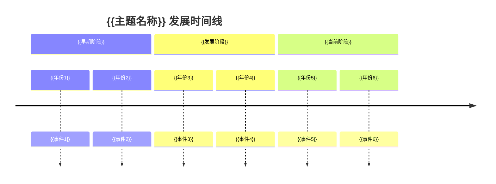

# {{主题名称}}

> *{{主题领域}} | 范围：{{范围}} | 成熟度：{{成熟度}} | 复杂性：{{复杂性}}*

## 主题概述

{{主题的全面概述，包括定义、范围和重要性。}}

## 核心问题

### 主要问题
1. **{{问题1}}** - {{详细说明}}
2. **{{问题2}}** - {{详细说明}}
3. **{{问题3}}** - {{详细说明}}

### 关键挑战
- {{挑战1}}
- {{挑战2}}
- {{挑战3}}

### 重要机遇
- {{机遇1}}
- {{机遇2}}
- {{机遇3}}

## 主题地图

### 核心概念
```mermaid
graph TD
    A[{{核心概念1}}] --> B[{{相关概念1}}]
    A --> C[{{相关概念2}}]
    B --> D[{{衍生概念1}}]
    C --> D
```

### 关键实体
- **人物**：[[关键人物1]], [[关键人物2]]
- **组织**：[[关键组织1]], [[关键组织2]]
- **项目**：[[关键项目1]], [[关键项目2]]
- **产品**：[[关键产品1]], [[关键产品2]]

### 重要概念
- **理论基础**：[[理论1]], [[理论2]]
- **方法技术**：[[方法1]], [[方法2]]
- **框架模型**：[[框架1]], [[框架2]]

## 历史发展

### 时间线


### 里程碑事件
- **{{里程碑1}}** ({{年份}}) - {{描述}} ([[相关源文档]])
- **{{里程碑2}}** ({{年份}}) - {{描述}} ([[相关源文档]])
- **{{里程碑3}}** ({{年份}}) - {{描述}} ([[相关源文档]])

### 关键人物
- [[关键人物1]] - {{贡献}}
- [[关键人物2]] - {{贡献}}
- [[关键人物3]] - {{贡献}}

## 当前状态

### 研究前沿
{{描述当前的研究前沿、最新发展和趋势。}}

### 实践应用
{{描述当前的实践应用、案例和部署情况。}}

### 主要争论
{{描述当前的主要争论、分歧或未解决问题。}}

## 子主题和分支

### 主要子主题
1. **[[子主题1]]** - {{描述}}
2. **[[子主题2]]** - {{描述}}
3. **[[子主题3]]** - {{描述}}

### 相关领域
- **[[相关领域1]]** - {{关系}}
- **[[相关领域2]]** - {{关系}}
- **[[相关领域3]]** - {{关系}}

## 知识结构

### 概念层次
```
{{主题名称}}
├── {{核心概念1}}
│   ├── {{子概念1.1}}
│   └── {{子概念1.2}}
├── {{核心概念2}}
│   ├── {{子概念2.1}}
│   └── {{子概念2.2}}
└── {{核心概念3}}
    ├── {{子概念3.1}}
    └── {{子概念3.2}}
```

### 技能要求
- **基础知识**：{{知识1}}, {{知识2}}
- **核心技能**：{{技能1}}, {{技能2}}
- **高级技能**：{{高级技能1}}, {{高级技能2}}

## 源文档全景

### 基础文献
- [[基础文献1]] - {{描述}}
- [[基础文献2]] - {{描述}}
- [[基础文献3]] - {{描述}}

### 关键论文
- [[关键论文1]] - {{描述}}
- [[关键论文2]] - {{描述}}
- [[关键论文3]] - {{描述}}

### 最新研究
- [[最新研究1]] - {{描述}}
- [[最新研究2]] - {{描述}}
- [[最新研究3]] - {{描述}}

## 应用场景

### 行业应用
- **{{行业1}}**：[[应用案例1]] - {{描述}}
- **{{行业2}}**：[[应用案例2]] - {{描述}}
- **{{行业3}}**：[[应用案例3]] - {{描述}}

### 社会影响
{{描述该主题对社会的潜在影响和意义。}}

### 未来展望
{{描述该主题的未来发展方向和潜力。}}

## 学习路径

### 入门路径
1. **第一步**：[[入门资源1]] - {{描述}}
2. **第二步**：[[入门资源2]] - {{描述}}
3. **第三步**：[[入门资源3]] - {{描述}}

### 进阶路径
1. **深入研究**：[[进阶资源1]] - {{描述}}
2. **专业方向**：[[专业资源1]] - {{描述}}
3. **前沿探索**：[[前沿资源1]] - {{描述}}

### 实践项目
- [[项目1]] - {{描述}}
- [[项目2]] - {{描述}}
- [[项目3]] - {{描述}}

## 争议和挑战

### 伦理问题
{{描述相关的伦理问题、争议或挑战。}}

### 技术限制
{{描述技术上的限制、障碍或挑战。}}

### 社会接受度
{{描述社会接受度、公众理解或政策挑战。}}

## 对wiki的整合

### 相关页面
- [[相关页面1]] - {{关系}}
- [[相关页面2]] - {{关系}}
- [[相关页面3]] - {{关系}}

### 知识缺口
1. {{知识缺口1}}
2. {{知识缺口2}}
3. {{知识缺口3}}

### 待探索问题
- [[待探索问题1]]
- [[待探索问题2]]
- [[待探索问题3]]

---

*本主题概述由LLM生成于 {{YYYY-MM-DD}}，整合了 [[源文档1]], [[源文档2]], [[源文档3]] 等信息。最后更新于 {{YYYY-MM-DD}}。*